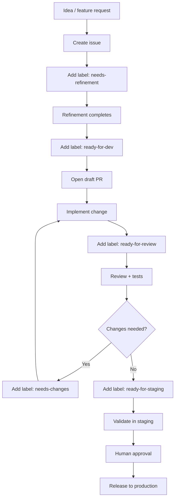

# Workflow diagram

## Notes

- The flow is intentionally simple and lightweight.
- The draft PR is the main working artifact during implementation.
- Staging is the main pre-production environment.
- Production release is manual and deliberate.
